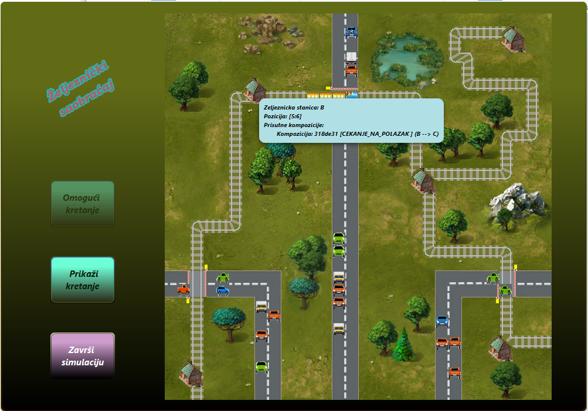

# Train Traffic Simulation

**Train Traffic Simulation** je napredna desktop aplikacija za simulaciju, upravljanje i koordinaciju željezničkog i drumskog saobraćaja u realnom vremenu.
Aplikacija demonstrira praktičnu primjenu naprednih koncepata objektno-orijentisanog programiranja, konkurentnog programiranja (višenitnosti), mehanizama sinhronizacije niti, dinamičkog učitavanja konfiguracije i serijalizacije objekata u Javi.

---

## 🛠️ Ključne Arhitektonske Funkcionalnosti

### 1. Konkurentnost i Sinhronizacija (Multithreading)
* **Nezavisne niti:** Svaka željeznička kompozicija i svako drumsko vozilo funkcionišu kao potpuno nezavisne niti koje se izvršavaju istovremeno bez predvidivog algoritma.
* **Sistem stanica kao kontrolera:** Kako bi se izbjegli sudari na jednokolosječnim dionicama, vozovi ne komuniciraju međusobno, već koordinaciju vrše željezničke stanice (A, B, C, D, E) koje upravljaju dozvolama za pristup dionicama i dinamički prilagođavaju brzine vozova u istom smjeru.
* **Pružni prelazi:** Sinhronizacija između drumskih vozila i vozova rješava se na pružnim prelazima. Vozila detektuju nailazak voza, bezbjedno se zaustavljaju i čekaju oslobađanje dionice i isključenje napona na mreži.
* **Električna mreža pod naponom:** Logika simulacije obuhvata i energetski podsistem – za kretanje električnih lokomotiva polje ispred, polja koja voz zauzima i polje iza moraju biti pod naponom.

### 2. Dinamičko Praćenje Fajlova (File Watcher)
* Aplikacija aktivno prati (`WatchService`) namjenski folder za vozove. Korisnik u realnom vremenu, putem običnog `.txt` fajla, može definisati novu liniju (sastav kompozicije, brzinu, polazište i odredište). Sistem automatski validira konfiguraciju i pokreće novu nit voza na mapi.

### 3. Istorija Kretanja i Serijalizacija
* Tokom vožnje, svaka kompozicija bilježi detaljnu istoriju (vrijeme, pređene koordinate, zadržavanja u stanicama).
* Po dolasku na odredište, ovi podaci se serijalizuju u folder kretanja, odakle ih poseban GUI modul ponovo učitava (deserijalizuje) i prikazuje korisniku.

---

## 📸 Pregled Grafičkog Interfejsa (GUI)

Aplikacija posjeduje bogat grafički interfejs izgrađen pomoću **JavaFX** biblioteke. Ispod su prikazani ključni moduli i ekrani simulacije u radu:

### 1. Praćenje aktivnih niti i sinhronizacija saobraćaja
Vizuelni prikaz simulacije sa matricom pruga, stanica i drumskog saobraćaja u realnom vremenu.
Detaljan grafički prikaz koordinacije vozova, upravljanja prugama i regulacije pružnih prelaza tokom trajanja simulacije.

<div>
  
</div>

<div>
  
</div>

### 2. Deserijalizacija i istorija kretanja (Telemetrija)
Poseban prozor unutar aplikacije koji omogućava učitavanje sačuvanih serijalizovanih datoteka i detaljan pregled istorije kretanja za svaku pojedinačnu kompoziciju.

<div>
  
</div>

---

## 💻 Tehnološki Stog i Alati

* **Jezik:** Java 17 (OpenJDK)
* **GUI Biblioteka:** JavaFX 17
* **Arhitekturalni koncepti:** Multithreading (`Thread`, `Runnable`), Sinhronizacija (`synchronized`, `Locks`), Java I/O i Serijalizacija.
* **Logovanje:** Integrisana `Logger` klasa za robusno upravljanje izuzecima u svim modulima.

---

## 🚀 Kako pokrenuti projekat lokalno

### Preduslovi
* Instaliran **Java 17 JDK**.
* Preuzet **JavaFX SDK 17**.

### Konfiguracija VM argumenata u VS Code
Da bi JavaFX moduli bili ispravno učitani, u vašem `.vscode/launch.json` fajlu dodajte putanju do vašeg lokalnog JavaFX SDK-a:

```json
"vmArgs": "--module-path /putanja/do/javafx-sdk-17/lib --add-modules javafx.controls,javafx.fxml"
