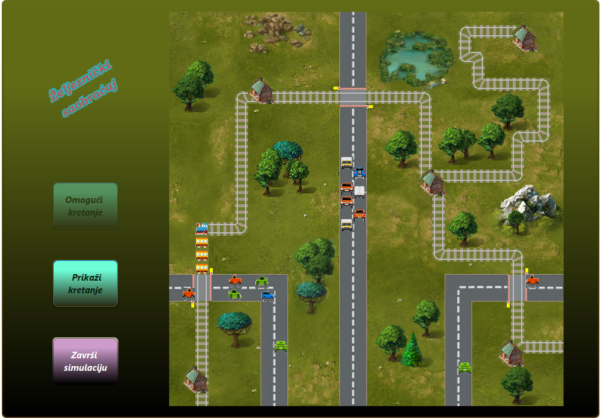
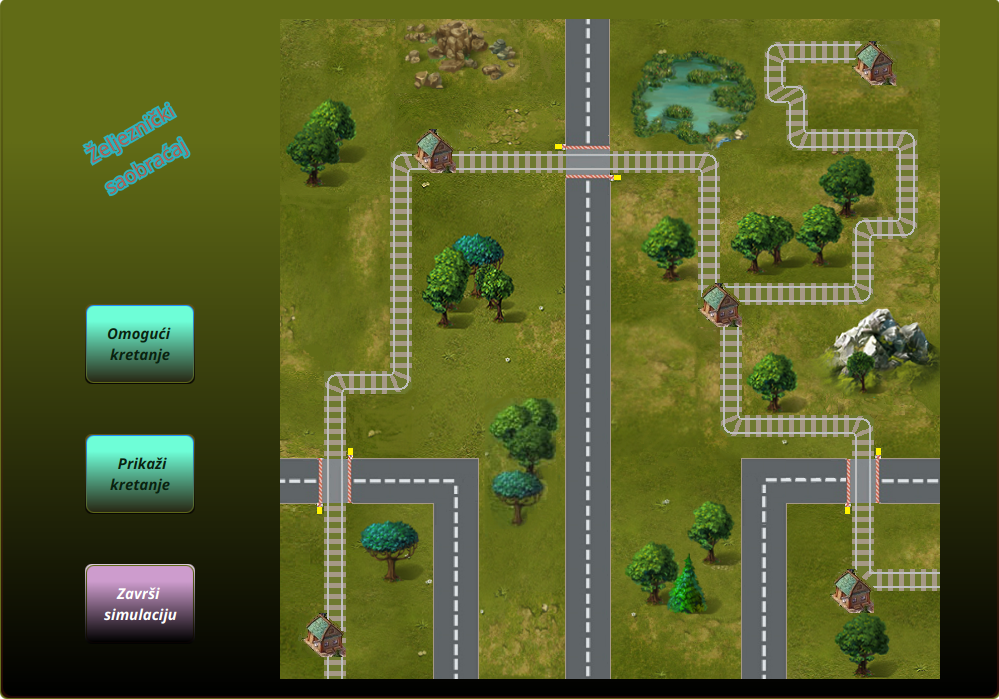
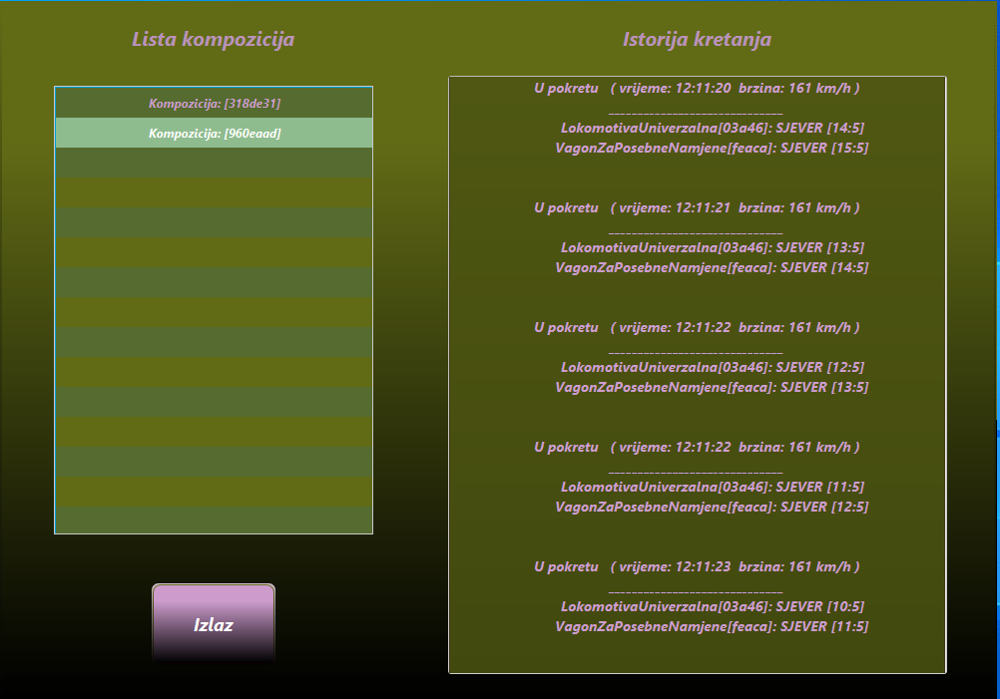

<br>
<br>
<div align="center">
  <h1>Train Traffic Simulation</h1> 
</div>
<br>
<br>
<br>

<div style="page-break-before: always;"></div>


**Train Traffic Simulation** je napredna desktop aplikacija za simulaciju, upravljanje i koordinaciju željezničkog i drumskog saobraćaja u realnom vremenu.

Aplikacija demonstrira praktičnu primjenu naprednih koncepata objektno-orijentisanog programiranja, konkurentnog programiranja (višenitnosti), mehanizama sinhronizacije niti, dinamičkog učitavanja konfiguracije i serijalizacije objekata u Javi.
<div align="center">
  &nbsp;
  
</div>

---

## 🛠️ Ključne Arhitektonske Funkcionalnosti

### 1. Konkurentnost, Sinhronizacija i Izbjegavanje Sudara (Multithreading)
* **Nezavisne niti:** Svaka željeznička kompozicija i svako drumsko vozilo funkcionišu kao potpuno nezavisne niti koje se izvršavaju istovremeno bez predvidivog algoritma.
* **Sistem stanica kao kontrolera dionica:** Kako bi se izbjegli sudari na jednokolosječnim dionicama, vozovi ne komuniciraju međusobno. Koordinaciju vrše željezničke stanice (A, B, C, D, E) koje upravljaju dozvolama za pristup dionicama i zadržavaju vozove ukoliko saobraća voz iz suprotnog smjera.
* **Dinamičko prilagođavanje brzine:** Ukoliko se na istoj dionici nađe više vozova koji se kreću u istom smjeru, sistem automatski i u realnom vremenu usklađuje njihove brzine kako bi se spriječio sudar sa zadnje strane, nakon čega ih vraća na fabričku brzinu.
* **Pružni prelazi:** Sinhronizacija između drumskih vozila i vozova rješava se na pružnim prelazima. Vozila detektuju nailazak voza, bezbjedno se zaustavljaju na slobodnoj poziciji ispred prelaza i čekaju oslobađanje dionice i isključenje napona na mreži.
* **Logika električne mreže:** Za kretanje kompozicija sa električnim lokomotivama, implementiran je energetski podsistem – polje ispred voza, sva polja koja voz trenutno zauzima i polje iza moraju biti pod naponom.

### 2. Autonomna Detekcija Putanje i Kompleksan OOP Model
* **Pametno trasiranje:** Kompozicije ne posjeduju unaprijed definisane rute. One u memoriji čuvaju isključivo naziv odredišne stanice, te autonomno pretražuju i detektuju elemente pruge na matrici dimenzija 30x30. Stanica C dodatno vrši ulogu inteligentnog čvorišta za usmjeravanje i skretanje vozova na odgovarajući kolosijek.
* **Složen domen i polimorfizam:** Implementirana je rigorozna poslovna logika sparivanja lokomotiva (putničke, teretne, univerzalne, manevarske; parne, dizelske, električne) i pripadajućih vagona sa specifičnim atributima (broj mjesta za spavanje, nosivost tereta, opisi restorana), kao i podjela drumskih vozila na automobile i kamione.

### 3. Dinamički "Hot-Reload" i Praćenje Fajlova (WatchService)
* **Praćenje foldera za vozove:** Aplikacija koristi `WatchService` za nadgledanje foldera sa vozovima. Dodavanjem običnog `.txt` fajla koji definiše sastav kompozicije, polazište, odredište i brzinu, aplikacija u realnom vremenu pokreće novu nit voza.
* **Učitavanje konfiguracije u hodu:** Ako se konfiguracioni fajl simulacije ručno izmijeni tokom rada, sistem automatski i bez restartovanja usvaja nova ograničenja brzine za sva naredna generisana vozila, dok dinamički balansira broj vozila na mapi (višak vozila se bezbjedno čuva u memorijskom redu van mape).

### 4. Telemetrija i Serijalizacija Podataka
* Svaki voz tokom kretanja detaljno bilježi svoju istoriju (vremenske oznake, tačne koordinate pređenih polja, zadržavanja u stanicama). Po dolasku na odredište, ovi podaci se serijalizuju u namjenski folder, odakle ih GUI modul ponovo deserijalizuje i tabelarno prikazuje korisniku.

---

## 📸 Pregled Grafičkog Interfejsa (GUI)

Aplikacija posjeduje bogat grafički interfejs izgrađen pomoću **JavaFX** biblioteke. Ispod su prikazani ključni moduli i ekrani simulacije u radu:

### 1. Glavni prozor simulacije i mapa mreže
Vizuelni prikaz simulacije sa matricom pruga, stanica i drumskog saobraćaja u realnom vremenu.

<div align="center">
  
</div>

### 2. Praćenje aktivnih niti i sinhronizacija saobraćaja
Detaljan grafički prikaz koordinacije vozova, upravljanja prugama i regulacije pružnih prelaza tokom trajanja simulacije.

<div align="center">
  
</div>

<br>

<div align="center">
  
</div>

### 3. Deserijalizacija i istorija kretanja (Telemetrija)
Poseban prozor unutar aplikacije koji omogućava učitavanje sačuvanih serijalizovanih datoteka i detaljan pregled istorije kretanja za svaku pojedinačnu kompoziciju.

<div align="center">
  
</div>

---

## 💻 Tehnološki Stog i Alati

* **Jezik:** Java 17 (OpenJDK)
* **GUI Biblioteka:** JavaFX 17
* **Arhitekturalni koncepti:** Multithreading (`Thread`, `Runnable`), Sinhronizacija (`synchronized`, `Locks`), Java I/O i Serijalizacija.
* **Logovanje:** Integrisana `Logger` klasa za robusno upravljanje izuzecima u svim modulima.

---

## 🚀 Kako pokrenuti projekat lokalno

### Preduslovi
* Instaliran **Java 17 JDK**.
* Preuzet **JavaFX SDK 17**.

### Konfiguracija VM argumenata u VS Code
Da bi JavaFX moduli bili ispravno učitani, u vašem `.vscode/launch.json` fajlu dodajte putanju do vašeg lokalnog JavaFX SDK-a:

```json
"vmArgs": "--module-path /putanja/do/javafx-sdk-17/lib --add-modules javafx.controls,javafx.fxml"
